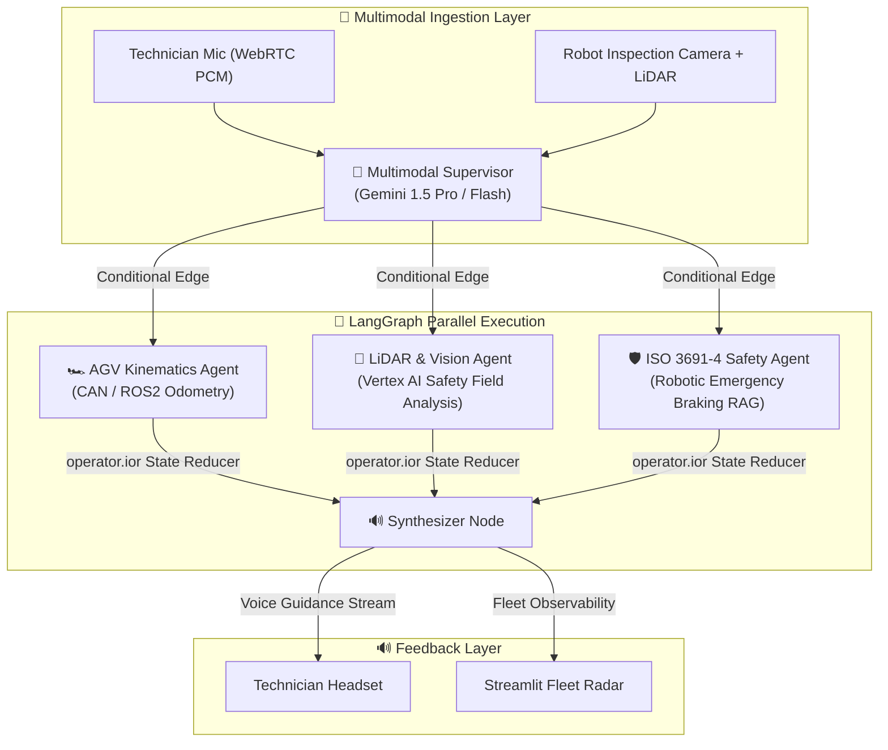

# AGVCopilot: Multimodal Voice & Vision AI for Autonomous Mobile Robot Fleets
> **Powered by Google Cloud Vertex AI (Gemini 1.5 Pro) & LangGraph StateGraph**  
> *Targeting Google Cloud Vertex AI & Smart Robotics Hackathons*

[](https://cloud.google.com/vertex-ai)
[](https://langchain-ai.github.io/langgraph/)
[](https://www.iso.org/)
[](https://streamlit.io/)

---

## 📌 Tagline
> **Multimodal hands-free diagnostic copilot for warehouse AGVs and factory AMRs, correlating live LiDAR point clouds, drive wheel kinematics, and ISO 3691-4 emergency stop protocols in sub-5ms.**

---

## 🏛️ Architecture: Vertex AI Gemini Multimodal + LangGraph StateGraph



## 🚀 Quick Start
```bash
pip install -r requirements.txt
python test_agv_agent.py
streamlit run app.py
```
