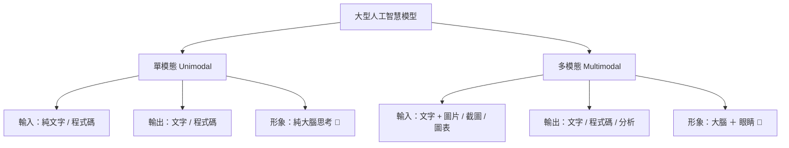

# AI 模型全景指南：單模態／多模態分類、小馬（Hermes）支援與費用全解析

> 本手冊整理當前電腦工具鏈（Ollama、Hermes Agent、Open Interpreter）所支援之大語言模型，詳細解析**單模態與多模態**的差異、**費用歸屬**以及**最佳應用情境**。

---

## 📑 目錄
1. [核心觀念：單模態 vs 多模態](#1-核心觀念單模態-vs-多模態)
2. [本地離線模型清單（Ollama 家族 — 100% 終身免費）](#2-本地離線模型清單ollama-家族--100-終身免費)
3. [雲端與遠端模型清單（Ollama Cloud / API）](#3-雲端與遠端模型清單ollama-cloud--api)
4. [模型費用機制三大分類](#4-模型費用機制三大分類)
5. [小馬（Hermes）最佳實戰搭配建議](#5-小馬hermes最佳實戰搭配建議)
6. [Ollama 常用指令速查](#6-ollama-常用指令速查)

---

## 1. 核心觀念：單模態 vs 多模態



### 概念對比表

| 特性 | 單模態模型（Unimodal / LLM） | 多模態模型（Multimodal / VLM） |
| :--- | :--- | :--- |
| **資料類型** | 純文字、Markdown、程式碼（Python, JS等） | 文字 ＋ 圖片（JPG, PNG, WebP）、截圖、手寫照片、圖表 |
| **形象比喻** | 🧠 **頂尖學者**（博覽群書、邏輯嚴謹，但沒有眼睛） | 👀 **全能偵探**（既能讀書推理，又有銳利的眼睛能看現場照片） |
| **擅長領域** | 寫程式、改 Bug、劇本創作、文意理解、數學推理 | 截圖轉程式碼、看圖解題、手寫考卷辨識、相片內容解說 |
| **代表模型** | `qwen2.5:3b`, `qwen3:8b`, `deepseek-v4` | `qwen3-vl:2b`, `llama3.2-vision:11b`, `Gemini 2.0` |

---

## 2. 本地離線模型清單（Ollama 家族 — 100% 終身免費）

> [!NOTE]
> 本地模型儲存於您的硬碟（E 槽），運算完全仰賴本機 CPU/GPU，**完全不需要連網、無任何字數上限、0 費用**。

| 模型名稱 | 體積 / 參數量 | 模態分類 | 核心特點 | 推薦用途 | 小馬（Hermes）適用度 |
| :--- | :--- | :--- | :--- | :--- | :--- |
| **`qwen2.5:3b`** | 1.9 GB | **單模態 (純文字)** | 極速輕量、CPU 佔用極低、中文理解強 | 日常對話、快速 Python 小工具生成 | ⭐⭐⭐⭐⭐（極速首選） |
| **`qwen3:8b`** | 5.2 GB | **單模態 (純文字)** | 知識庫廣、邏輯推演更細膩 | 複雜邏輯程式、長篇教材編寫 | ⭐⭐⭐⭐⭐（主力全能） |
| **`qwen2.5:14b`** | 9.0 GB | **單模態 (純文字)** | 深度推理、高難度代碼架構分析 | 專業級研究、嚴謹文字審閱 | ⭐⭐⭐⭐（需較多記憶體） |
| **`qwen3-vl:2b`** | 1.9 GB | 👁️ **視覺多模態** | 具備視覺識別能力、繁中 OCR 極佳 | 截圖辨識、UI 畫面轉代碼、看圖解題 | ⭐⭐⭐⭐⭐（輕量看圖神器） |
| **`llama3.2-vision:11b`** | 7.8 GB | 👁️ **視覺多模態** | Meta 旗艦視覺、相片細節識別強 | 高解析度照片分析、複雜視覺場景 | ⭐⭐⭐⭐（適合高階硬體） |

---

## 3. 雲端與遠端模型清單（Ollama Cloud / API）

> [!TIP]
> 雲端模型是在遠端大型伺服器叢集上運作，需保持網路連線。

| 模型名稱 | 模態分類 | 平台 / 架構 | 特色與強項 |
| :--- | :--- | :--- | :--- |
| **`glm-5.2:cloud`** | 👁️ **視覺多模態** | 智譜清言 | 圖文綜合分析、中文多模態任務 |
| **`kimi-k3:cloud`** | 👁️ **多模態 / 長文本** | 月之暗面 | 支援超長文檔閱讀、長篇教案分析 |
| **`deepseek-v4-flash:cloud`** | **單模態 (純文字)** | 深度求索 | 演算法邏輯、數學難題、極速代碼生成 |
| **`nemotron-3-ultra:cloud`** | **單模態 (純文字)** | NVIDIA | 企業級嚴謹推理、多步驟規劃 |
| **`minimax-m2.7 / m3:cloud`** | **單模態 (純文字)** | MiniMax | 擬真口吻、情境教學對話、故事創作 |
| **`gpt-oss:20b / 120b:cloud`** | **單模態 (純文字)** | 開源大算力 | 廣泛常識庫、綜合問題解答 |

---

## 4. 模型費用機制三大分類

```
┌─────────────────────────────────────────────────────────────┐
│  🟢 第一類：100% 終身免費（本地開源）                         │
│     - 代表：Ollama 內的所有模型（Qwen, Llama, DeepSeek 等）    │
│     - 費用：$0 元（永遠免費、不限次數、離線可用）            │
├─────────────────────────────────────────────────────────────┤
│  🟡 第二類：平台免費額度（Free Tier）                        │
│     - 代表：Groq 免費層、Google AI Studio (Gemini Free)、    │
│             OpenRouter (標註 :free 的模型)                  │
│     - 費用：$0 元（每天/每分鐘有次數頻率限制，個人夠用）     │
├─────────────────────────────────────────────────────────────┤
│  🔴 第三類：商業付費 API（需綁卡儲值）                       │
│     - 代表：OpenAI (GPT-4o)、Anthropic (Claude 3.5 Sonnet)   │
│     - 費用：依輸入/輸出的 Token（字數）扣款                   │
└─────────────────────────────────────────────────────────────┘
```

> [!IMPORTANT]
> **安心保障**：您目前在電腦上使用的 **Ollama + Hermes Desktop** 屬於 **「🟢 第一類（100% 終身免費）」**，運算均在本機完成，絕不會產生任何帳單或隱藏扣款！

---

## 5. 小馬（Hermes）最佳實戰搭配建議

依據您的教學備課與工作情境，建議靈活切換模型搭配：

1. **日常極速出產小工具（如抽籤、計時器、文字整理）**：
   - 👉 首選 **`qwen2.5:3b`**（反應最快、最省電、代碼精準）。
2. **需要模型「看懂圖片／批改考卷截圖／UI轉程式」**：
   - 👉 首選 **`qwen3-vl:2b`**（具備視覺多模態眼睛）。
3. **編寫大型複雜專案、多檔案系統規劃**：
   - 👉 首選 **`qwen3:8b`** 或 **`qwen2.5:14b`**（邏輯推理能力最強）。

---

## 6. Ollama 常用指令速查

| 常用指令 | 動作說明 |
| :--- | :--- |
| `ollama list` | 檢視本機已安裝的模型清單與容量大小 |
| `ollama pull <模型名稱>` | 下載指定的模型到本機（不立即開啟對話） |
| `ollama run <模型名稱>` | 啟動模型並直接在終端機展開即時對話 |
| `ollama rm <模型名稱>` | 刪除不再使用的本機模型以釋放硬碟空間 |
| `ollama ps` | 檢視目前正在記憶體中運行的模型 |

---
*文件編制：小幫手*  
*建立日期：2026-08-21*
