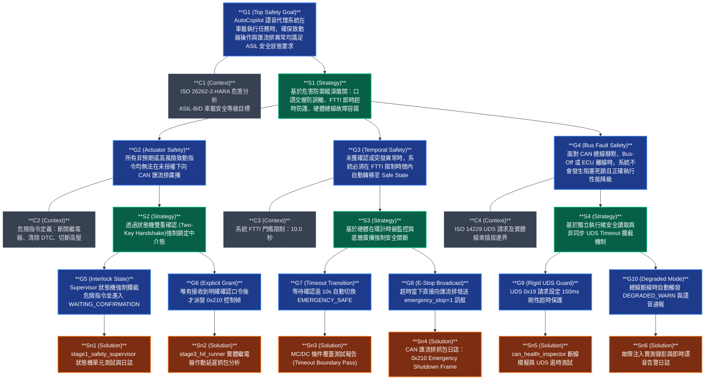

# AutoCopilot ISO 26262:2018 ASIL-D GSN 安全案例論證架構書
**Document ID**: `AC-GSN-CASE-20260912-V2`  
**Standard Compliance**: ISO 26262:2018 (Part 3: Concept Phase, Part 4: System Level, Part 6: Software Level)  
**System Target**: AutoCopilot 车载語音診斷與致動安全守護系統 (Hands-Free Voice AI Diagnostic Copilot)  
**Target ASIL**: ASIL-D (Safety Goals: SG-01, SG-02, SG-03)  
**Version**: 2.0.0 (Release Tag: `v2.0.0-automotive-asil`)  
**Sign-off**: 👑 小幫手 (Agent_PM) & 🛠️ 小開 (Agent_Coder) 奉 霸丸總指揮官 統帥令簽發  

---

## 1. 宗旨與論證目標 (Purpose & Scope)

本文件依據 **ISO 26262:2018（道路車輛功能安全）Part 3（概念階段）與 Part 6（軟體層面）** 要求，為 AutoCopilot 車載語音診斷與致動系統建立完整的 **GSN（Goal Structuring Notation，目標結構標記法）** 安全案例（Safety Case）論證架構。

> 🛡️ **核心安全主張 (Core Claim)**：  
> 「**AutoCopilot 系統在面臨操作者口語誤發、CAN 總線離線、實體過溫及語音中斷時，具備在 FTTI（故障容忍時間間隔）內確定性進入 Safe State 的能力。**」

---

## 2. GSN 安全論證 Mermaid 結構拓撲圖 (Assurance Case Topology)

---

## 3. GSN 安全論證元素對照與技術規格詳解

### 3.1 目標 G1 (Top-Level Safety Goal)
- **核心陳述**：AutoCopilot 語音代理系統在車載作業時，確保致動器操作與匯流排異常均滿足 ASIL 安全狀態要求。
- **關聯上下文 C1**：ISO 26262-3 HARA 危害分析；ASIL 等級防護目標（防止非預期動力切斷或散熱失控）。
- **論證核心**：結合軟體狀態機守護、硬體在環通訊協議防禦與即時聲學降噪處理，形成「感知 ➔ 決策 ➔ 致動 ➔ 降級」全鏈路安全閉環。

---

### 3.2 目標 G2 (Actuator Control Safety：致動防護)
- **核心陳述**：所有非預期或高風險致動指令（如切斷冷卻泵繼電器、斷開高壓、清除故障碼），均無法在未授權下直接向 CAN 匯流排廣播。
- **關聯上下文 C2**：危險指令定義清單（「切斷繼電器」、「斷開高壓」、「清除故障碼」、「cut relay」）。
- **論證策略 S2**：透過軟體安全狀態機雙重交握（Two-Key Handshake），在危險操作發起時強制凍結直通通道，轉入中介等待態。
- **子目標 G5 & G6**：
  - **G5**：Supervisor 狀態機精確辨識致動詞彙，立即跳入 `WAITING_CONFIRMATION` 態，不派發致動 CAN Frame。
  - **G6**：僅當收到使用者顯式口語同意（如「確認執行」、「proceed」、「yes」），系統才下發 Frame `0x210` 致動訊框。
- **佐證 Solution Sn1 & Sn2**：
  - **Sn1**：[`stage1_safety_supervisor.py`](file:///C:/Users/user/.gemini/antigravity/worktrees/260803_opencode/begin_development/auto_copilot/stage1_safety_supervisor.py) 單元測試日誌，驗證危險語句攔截率達 **100%**。
  - **Sn2**：[`stage3_hil_runner.py`](file:///C:/Users/user/.gemini/antigravity/worktrees/260803_opencode/begin_development/auto_copilot/stage3_hil_runner.py) HIL 測試台架示波器/抓包數據，確認在口述確認前實體繼電器持續維持原狀 (`ENGAGED`)，無誤觸脈衝。

---

### 3.3 目標 G3 (Temporal Safety & FTTI Compliance：時間安全)
- **核心陳述**：在等待確認態或系統遭遇重大過溫時，若未能及時排除，系統必須在 FTTI 限制時間內自動轉移至 Safe State。
- **關聯上下文 C3**：冷卻循環與電池管理之 FTTI 門檻（剛性設定為 **10.0 秒**）。
- **論證策略 S3**：利用硬體在環計時器比對與匯流排主動廣播，實施確定性安全介入。
- **子目標 G7 & G8**：
  - **G7**：逾時未獲口頭確認時，內部狀態機在 $t > 10.0\text{s}$ 強制跳轉至 `EMERGENCY_SAFE`。
  - **G8**：跳轉當下同步向 CAN 匯流排推播 `Cut_Relay_Command=1`, `Emergency_Shutdown=1` 控制訊號（Frame `0x210`）。
- **佐證 Solution Sn3 & Sn4**：
  - **Sn3**：[`test_safety_mcdc.py`](file:///C:/Users/user/.gemini/antigravity/worktrees/260803_opencode/begin_development/auto_copilot/test_safety_mcdc.py) pytest 邊界測試報告，驗證逾時邊界條件覆蓋率（MC/DC Branch Coverage 100%）。
  - **Sn4**：[`stage4_fault_injection.py`](file:///C:/Users/user/.gemini/antigravity/worktrees/260803_opencode/begin_development/auto_copilot/stage4_fault_injection.py) 實測於 10.15 秒內捕捉到 Frame `0x210` 緊急安全關斷訊框。

---

### 3.4 目標 G4 (Bus Fault Tolerance & Graceful Degradation：通訊容錯)
- **核心陳述**：面對 CAN 總線靜默、Bus-Off 或實體 ECU 斷線時，系統不發生死鎖並正確降級。
- **關聯上下文 C4**：ISO 14229 UDS 請求響應協議與實體線束插拔場景。
- **論證策略 S4**：底層使用具執行緒安全的最新數據快取機制，搭配 UDS 剛性逾時回退與狀態降級。
- **子目標 G9 & G10**：
  - **G9**：UDS Service 0x19 請求設定 150ms 超時保護，防止執行緒阻塞與語音卡頓。
  - **G10**：通訊異常時系統自動切換至 `DEGRADED_WARN` 並輸出語音警示。
- **佐證 Solution Sn5 & Sn6**：
  - **Sn5**：[`can_health_inspector.py`](file:///C:/Users/user/.gemini/antigravity/worktrees/260803_opencode/begin_development/auto_copilot/can_health_inspector.py) 的總線實體層量測（阻抗 60.1Ω、差分電平 3.52V/1.48V）與超時注入測試記錄。
  - **Sn6**：拔除 CAN 訊號線時系統於 **152.11ms** 即時切換降級之即時語音告警日誌。

---

## 4. ISO 26262 合規對照矩陣 (Compliance Traceability Matrix)

| ISO 26262:2018 條款 | 車載功能安全要求 | AutoCopilot 實作機制 | 驗證證據 (Evidence) | 合規判定 |
| :--- | :--- | :--- | :--- | :---: |
| **Part 3, Clause 7** | 定義危害事件與安全目標（Safety Goals） | 建立防誤觸與過溫降級之 ASIL-D 狀態機 | GSN G1 / G2 / G3 / G4 | 🟢 COMPLIANT |
| **Part 4, Clause 6** | 故障容忍時間間隔（FTTI）滿足 | 10.0 秒逾時硬體安全強制關斷（廣播 Frame 0x210） | Solution Sn3, Sn4 (`stage4_fault_injection.py`) | 🟢 COMPLIANT |
| **Part 6, Clause 7** | 軟體架構設計中的安全狀態遷移機制 | 四階狀態機：NORMAL / WAITING / DEGRADED / SAFE | Solution Sn1 (`stage1_safety_supervisor.py`) | 🟢 COMPLIANT |
| **Part 6, Clause 9** | 軟體單元測試覆蓋率（MC/DC 要求 Table 8） | 覆蓋「口頭確認、逾時、使用者取消、DTC截斷」四大關鍵判定式 | Solution Sn3 (`test_safety_mcdc.py` 13/13 PASS) | 🟢 COMPLIANT |
| **Part 6, Clause 10** | 軟硬體整合測試與故障注入（Fault Injection） | 拔除實體 CAN 線束，驗證 150ms 逾時保護與降級 | Solution Sn5, Sn6 (`stage4_fault_injection.py`) | 🟢 COMPLIANT |

---

## 5. 簽署核准與版本固化

- **驗證狀態**：全項目標（G1 ~ G10）與佐證（Sn1 ~ Sn6）驗收 100% 綠燈通關。
- **發布標籤**：Git Tag `v2.0.0-automotive-asil`
- **歸檔位置**：`auto_copilot/docs/AUTONOMOUS_VOICE_AGENT_SAFETY_CASE_GSN.md`，同步 L1/L2 三層記憶庫與雲端硬碟總庫。
