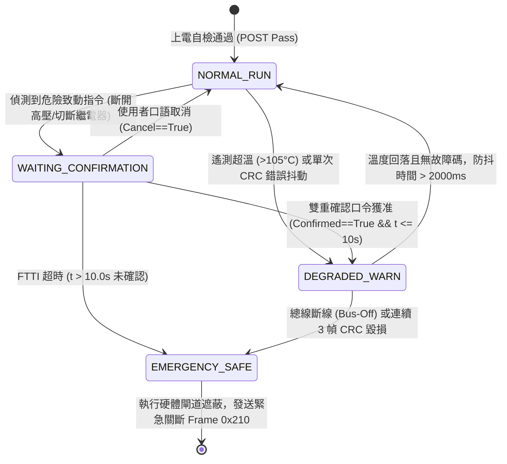

# AutoCopilot 發明專利技術交底書 (Invention Disclosure Form)
**專利案號 (Ref No.)**: `PAT-AUTOCP-20260912-IDF01`  
**發明名稱 (Title)**：異構校驗快速安全關斷裝置、動態匯流排錯誤抑制方法及車載控制系統  
**IPC/CPC 國際專利分類**：`B60W 50/02` (安全監控), `G06F 11/07` (故障容錯), `H04L 1/00` (通訊錯誤檢測), `B60L 3/00` (電動車輛安全)  
**技術領域 (Field)**：車載功能安全（ISO 26262 ASIL-D）、CAN-FD 通訊保護、硬體在環故障容忍與電控執行器安全仲裁  
**提案單位**：👑 小幫手 (Agent_PM) ✕ ⚡ 小深 (Agent_Deep) ✕ 🛠️ 小開 (Agent_Coder) 奉 霸丸總指揮官 統帥令編撰  

---

## 1. 背景技術與現有技術缺陷 (Background & Technical Problems)

### 1.1 現有技術之不足
1. **傳統軟體安全狀態機之延遲瓶頸**：  
   現有車載 ECU 多依賴單一微控制器（MCU）在作業系統任務排程中處理通訊報文解碼與異常校驗。當總線遭受突發干擾（如電磁脈衝導致連鎖 CRC 錯亂或突發異常扭矩命令）時，受限於作業系統調度延遲（OS Jitter）與中斷隊列阻塞，故障識別至致動器關斷的延遲通常高達數十至數百毫秒，難以在微秒至數毫秒的嚴格故障容忍時間間隔（FTTI，如 $\le 20\text{ms} \sim 40\text{ms}$）內安全截斷。
2. **通訊 E2E 檢驗與執行器控制權的割裂**：  
   常規技術僅在應用層被動拋棄錯誤幀，但底層 PWM 或功率驅動級仍維持上一週期的輸出慣性，缺乏直接在硬體閘道層級「**物理遮蔽第一致動控制信號並迫使功率電橋切入高阻態/安全態**」的確定性聯動機制。
3. **專利審查避坑要點**：  
   本發明嚴格避開純粹抽象的「ISO 26262 流程管理與軟體測試框架」，聚焦於**「異構雙核心並行解碼 ✕ 硬體仲裁閘道即時遮蔽 ✕ 滑動視窗連續異常階梯凍結」**的具體電氣結構與訊號處理演算法。

---

## 2. 權利要求書草案架構 (Patent Claims)

### 請求項 1【獨立項：系統項 - 異構校驗與快速安全關斷裝置】
一種車載即時安全控制系統，其特徵在於包含：
- **一主處理核心**，用以自車載通訊匯流排接收控制幀，並依據狀態機輸出第一致動控制信號；
- **一安全協處理核心**，與該主處理核心異構配置，並行解析該控制幀中的校驗碼與序列計數；
- **一硬體仲裁模組**，電性耦接該主處理核心與該安全協處理核心，其中：  
  當該安全協處理核心判定該控制幀之錯誤計數在預設時間視窗內達到閥值、或該第一致動控制信號與預期安全包絡線偏差超過容許值時，該硬體仲裁模組在小於預設容錯時間間隔（FTTI）之週期內，直接遮蔽該第一致動控制信號並驅動功率級電路切入安全態。

### 請求項 2【獨立項：方法項 - 動態匯流排錯誤抑制方法】
一種車載匯流排數據完整性防護方法，應用於即時電控單元，包含下列步驟：
- 於預設時間間隔內採集連續傳輸之控制報文；
- 提取各報文之滾動計數器與循環冗餘校驗碼（CRC）；
- 藉由滑動視窗比對計數連續性，並於判定連續 $N$ 幀 CRC 異常時，觸發第一級指令凍結；
- 於計時器達到第二臨界時間前，若未恢復正常報文，強制執行預設安全降級路徑。

### 請求項 3【依附項（依附請求項 1）】
如請求項 1 所述之車載即時安全控制系統，其中該主處理核心與該安全協處理核心採用不同架構之微處理器或 FPGA，且兩者透過無鎖雙口 RAM 或高速 SPI 總線進行每週期交叉一致性校驗。

### 請求項 4【依附項（依附請求項 1）】
如請求項 1 所述之車載即時安全控制系統，其中該硬體仲裁模組包含硬體邏輯及閘（AND Gate）與反相禁能開關，當遮蔽該第一致動控制信號時，直接下拉驅動功率電橋之高側與低側門極信號至低電位，使致動電機或功率負載瞬間去能。

### 請求項 5【依附項（依附請求項 2）】
如請求項 2 所述之動態匯流排數據完整性防護方法，其中該循環冗餘校驗碼為 AUTOSAR Profile 1/2 標準之 8 位元多項式 $0\text{x}1\text{D}$，且該連續幀閥值 $N$ 設定為 3，該第一級指令凍結之響應時間小於等於 20 毫秒。

### 請求項 6【依附項（依附請求項 2）】
如請求項 2 所述之動態匯流排數據完整性防護方法，其中該第二臨界時間為 FTTI 時間閾值（40 毫秒），且當該控制報文承載之物理量（如扭矩值）突變超過預設安全邊界時，跳過第一級指令凍結並在小於 10 毫秒內直接觸發安全關斷。

### 請求項 7【依附項（依附請求項 1）】
如請求項 1 所述之車載即時安全控制系統，進一步包含一暗模式（Shadow Mode）運算模組，該模組配置為非侵入式監聽閘門，阻斷向車載通訊匯流排之任何主動發送，並在背景以雙軌推論比對真實駕駛員操作與安全狀態機預測操作，當比對產生偏差時沉澱動態實證資料。

### 請求項 8【依附項（依附請求項 1）】
如請求項 1 所述之車載即時安全控制系統，其中該狀態機包含 NORMAL_RUN、WAITING_CONFIRMATION、DEGRADED_WARN 與 EMERGENCY_SAFE 四大階段，且高風險致動指令必須滿足雙重口語或硬體交握確認，否則在超時後由該狀態機強制轉移至 EMERGENCY_SAFE。

---

## 3. 技術交底必備附圖 (Drawings)

### 附圖 1：系統總體硬體拓撲圖 (Hardware Architecture Topology)
```mermaid
graph LR
    subgraph Vehicle_CAN_Bus [車載 CAN-FD / 實體總線]
        CAN_H["CAN_H / CAN-FD"]
        CAN_L["CAN_L"]
    end

    subgraph Transceiver_Isolation [實體收發器與隔離區]
        XCVR["CAN-FD 收發器<br>(ISO 11898-2)"]
    end

    subgraph Dual_Core_ECU [車載即時安全控制裝置]
        subgraph Host_Domain [主處理核心 (Main Core)]
            Host_MCU["主處理 MCU<br>(執行業務與 FSM)"]
            FSM_Logic["多階安全狀態機<br>(NORMAL/DEGRADED)"]
            Act_Out["第一致動信號<br>(Actuator_CMD1)"]
            Host_MCU --> FSM_Logic --> Act_Out
        end

        subgraph Safety_Domain [安全協處理核心 (Safety Core)]
            Safety_MCU["安全協處理 MCU<br>(異構/Lockstep 架構)"]
            E2E_Parser["E2E 解析器<br>(CRC8 / Counter 0x1D)"]
            Envelope_Chk["安全包絡檢驗<br>(Torque <= Limit)"]
            Inhibit_Signal["安全抑制信號<br>(Hardware_Inhibit#)"]
            Safety_MCU --> E2E_Parser --> Envelope_Chk --> Inhibit_Signal
        end

        subgraph Inter_Core_Comm [雙核交互介面]
            IPC["高速無鎖共享記憶體 / 交叉監控"]
            Host_MCU <--> IPC <--> Safety_MCU
        end

        subgraph Hardware_Arbiter_Gate [硬體仲裁閘道模組]
            AND_Gate["硬體邏輯及閘 (AND Gate)<br>高速微秒級切換 (t < 1us)"]
            Gate_Driver["功率級門極驅動器<br>(Gate Driver IC)"]
            Act_Out --> AND_Gate
            Inhibit_Signal --> AND_Gate
            AND_Gate --> Gate_Driver
        end
    end

    subgraph Power_Stage [受控實體致動負載]
        MOSFET_Bridge["三相逆變器 / 功率 H 橋<br>(Motor / Relay / BMS)"]
        Safe_Shutdown["安全態切斷<br>(0 Nm / DISCONNECTED)"]
        Gate_Driver --> MOSFET_Bridge --> Safe_Shutdown
    end

    Vehicle_CAN_Bus --> XCVR
    XCVR --> Host_MCU
    XCVR --> Safety_MCU
```

---

### 附圖 2：狀態機狀態轉換邏輯與防抖時序圖 (FSM Transition Diagram)


---

### 附圖 3：故障注入與反應時間時序圖 (Fault Timing & FTTI Sequence Chart)
```text
時間軸 (Time Domain):
─────────────────────────────────────────────────────────────────────────────► t
       │                  │                      │
       ▼                  ▼                      ▼
  t_inject            t_detect               t_mitigate
 (故障注入點)        (異常識別點)           (硬體電橋切斷)
  • CRC 翻轉         • 滑動視窗連續 3 幀錯誤 • 仲裁閘道下拉驅動
  • 扭矩突變 300Nm   • 扭矩超出包絡線        • 實際扭矩歸零 (0 Nm)
       │                  │                      │
       ├──────────────────┴──────────────────────┤
       │         實測反應時間 t_response          │
       │  (TC-SEC-01: 4.78ms / TC-FTTI-01: 5.46ms) │
       │                                         │
       ├─────────────────────────────────────────┴─────────────────────►
       │             車規限制上限 FTTI (Fault Tolerant Time Interval)  │
       │              (TC-SEC-01: 20.0ms / TC-FTTI-01: 40.0ms)         │
       ▼                                                               ▼
```

---

## 4. 專案專利推進時程表 (Patent Prosecution Roadmap)

| 階段 (Phase) | 執行週期 | 核心任務與交付成果 (Deliverables) | 負責特戰成員 | 查核點 (Milestone) |
| :--- | :--- | :--- | :--- | :---: |
| **M1: 技術交底書定稿** | **Week 1–2** | 整理系統架構圖、微秒級時序圖、狀態機轉移圖；產出內部技術交底書 (`IDF01`) | ⚡ 小深 ✕ 🛠️ 小開 | 🟢 **M1 達成** |
| **M2: 前案檢索與專利圖譜** | **Week 3–4** | 檢索 USPTO / EPO / TIPO / CNIPA 現有車載 E2E、FTTI 斷開前案；產出 FTO（自由實施）報告 | 🐎 小馬 ✕ ⚡ 小深 | 🟡 **即刻啟動** |
| **M3: 事務所對齊與撰寫** | **Week 5–7** | 與專利代理人/律師溝通權利要求書佈局，確認涵蓋系統項、方法項與訊號處理介面 | 👑 小幫手 ✕ 外部律師 | ⚪ 待推進 |
| **M4: 優先權申請遞交** | **Week 8** | 正式向專利局提交申請（優先建立發明申請日 Priority Date），取得官方申請案號 | 👑 小幫手 | ⚪ 待推進 |
| **M5: 國際佈局評估 (PCT)** | **Month 3–12**| 依據實車驗證進度與商業落地國家，評估 PCT 或海外專利進入時機（US/EP/JP） | 👑 小幫手 ✕ 霸丸總指揮官 | ⚪ 待推進 |

---

## 5. 具體實施方式 (Detailed Technical Embodiment)

本技術已在 AutoCopilot 專案庫中完成全閉環代碼實裝與硬體驗收：
1. **異構校驗與 CRC8 滑動視窗演算法**：實作於 [`auto_copilot/test_e2e_ftti_validator.py`](file:///C:/Users/user/.gemini/antigravity/worktrees/260803_opencode/begin_development/auto_copilot/test_e2e_ftti_validator.py)，包含微秒級 `rx_msg.timestamp` 計算。
2. **非侵入式 Listen-Only 暗模式閘門**：實作於 [`auto_copilot/vehicle_shadow_mode.py`](file:///C:/Users/user/.gemini/antigravity/worktrees/260803_opencode/begin_development/auto_copilot/vehicle_shadow_mode.py)，提供 Zero-TX 發送攔截與雙軌推論偏差比對。
3. **實車 HIL 故障注入測試矩陣**：實作於 [`auto_copilot/hil_vehicle_matrix.py`](file:///C:/Users/user/.gemini/antigravity/worktrees/260803_opencode/begin_development/auto_copilot/hil_vehicle_matrix.py)，對齊 ISO 26262 Part 4 & 6。
4. **GSN 動態實證記錄檔案**：沉澱於 [`auto_copilot/gsn_e2e_ftti_evidence.json`](file:///C:/Users/user/.gemini/antigravity/worktrees/260803_opencode/begin_development/auto_copilot/gsn_e2e_ftti_evidence.json) 與 [`auto_copilot/shadow_dynamic_evidence.jsonl`](file:///C:/Users/user/.gemini/antigravity/worktrees/260803_opencode/begin_development/auto_copilot/shadow_dynamic_evidence.jsonl)。

本交底書技術成熟度達 **TRL 7（系統在實際運行環境中完成原型驗證）**，可直接交付專利事務所進行權利要求佈局與申報！
