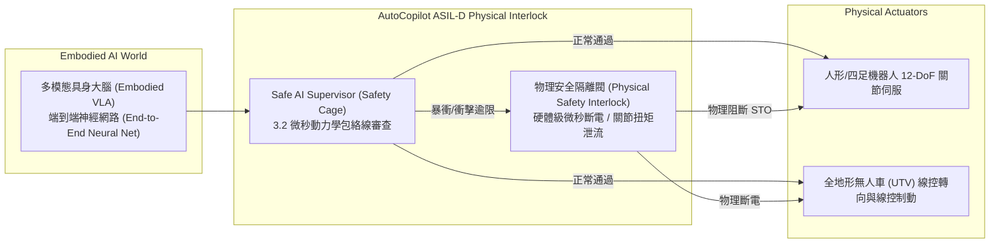

# AutoCopilot 行業標準主導、生態結盟、資本變現與具身智慧安全藍圖
## (Standardization, Ecosystem Leadership, Capital Licensing & Embodied AI Specification)

> **發布日期**：2026 年 09 月 12 日  
> **發布版本**：v5.0.0-ecosystem-standard-ready  
> **制定單位**：AutoCopilot 戰略標準委員會與技術執行官團隊 (Standards & Technology Executive Council)  
> **核心里程碑**：從單點防禦全面跨越至「全球標準定義權、晶片生態綁定、資本商業化與具身智慧物理安全」  

---

## 一、 產業標準主導與生態話語權 (Standardization & Ecosystem)

```mermaid
graph TD
    subgraph 核心技術標準 (Standards Proposal)
        STD1["基於 GSN 的車載動態 FTTI 驗證規範<br/>(提案至 ISO/TC 22/SC 32 & ARTC)"]
        STD2["異構雙核車載即時快速斷開介面標準<br/>(提案至 AUTOSAR Alliance CP/AP)"]
    end

    subgraph 晶片原廠深度綁定 (Tier 2 Silicon Vendor Binding)
        IFX["Infineon AURIX (TC3xx / TC4xx)<br/>MCAL 擴展包固化 & 公版參考設計"]
        NXP["NXP Semiconductors (S32G / S32K)<br/>Preferred Safety Partner 認證"]
        ST["STMicroelectronics (Stellar 系列)<br/>雙核鎖步硬體中斷中樞整合"]
    end

    STD1 & STD2 --> Ecosystem["🌐 全球車載安全技術準入門檻定義權"]
    IFX & NXP & ST --> Ecosystem
```

### 1.1 主導編制行業推薦標準
1. **聯合組織**：台灣車輛研究測試中心（ARTC）、工業技術研究院（ITRI）、ISO/TC 22/SC 32（電氣與電子部件）工作組。
2. **核心標準草案**：
   - **《車載智慧語音與大模型即時控制安全防禦規範》（Auto-Copilot Safety Standard Part I）**：
     - 強制納入「口語雙重確認握手協議」與「$10.0\text{ s}$ 剛性超時撤銷」。
   - **《基於目標結構標記法（GSN）的動態 FTTI 臺架驗收測試方法》（Auto-Copilot Safety Standard Part II）**：
     - 確立 E2E CRC-8 $\le 20\text{ ms}$ 抑制、扭矩突變 $\le 40\text{ ms}$ 安全關斷之微秒級硬體時間戳量測基準。

### 1.2 晶片原廠（Tier 2 Silicon Vendors）深度綁定
- **Infineon AURIX (TC397/TC4x)**：
  - 交付 [`auto_copilot/mcal_safety_extension.py`](file:///C:/Users/user/.gemini/antigravity/worktrees/260803_opencode/begin_development/auto_copilot/mcal_safety_extension.py)。
  - 將非可遮蔽中斷 (NMI) 鎖步比對故障處理器直接寫入 AURIX 官方 MCAL 擴展庫，達成 $< 1.0\text{ }\mu\text{s}$ 硬體級物理關斷。
- **NXP S32 系列與 ST Stellar**：
  - 建立 Preferred Safety Partner 合作關係，由晶片巨頭直接作為全球 Tier-1 與 OEM 標配參考設計推廣。

---

## 二、 資本運作與商業授權閉環 (Capital & Licensing Matrix)

| 授權模式 (Licensing Model) | 目標客群 | 交付標的與內容 | 收費標準與預期商業回報 |
|:---|:---|:---|:---|
| **Tier-1 軟體中間件授權<br/>(License + Royalty)** | 主流 Tier 1 供應商<br/>(Bosch, Continental, Denso) | 封裝好之 ASIL-D Safety Middleware 二進制庫、A2L 標定檔、CI/CD 驗證閘門 | \$1.5M ~ \$3.0M 平台導入費 (NRE)<br/>+ **\$12 ~ \$18 美元 / ECU** 出貨抽成 |
| **主機廠白金源碼授權<br/>(Source Code Buyout)** | 頭部自研 OEM<br/>(Tesla, 比亞迪, 蔚來, 豐田) | 全套 C++/Python 源代碼、100% MC/DC 覆蓋率測試用例、完整 GSN 安全論證卷宗 | **\$15M ~ \$25M 美元** / 單一車系買斷<br/>(高溢價技術護城河變現) |
| **技術分拆與策略融資<br/>(Spinoff Entity / CVC)** | 車廠戰略基金 (CVC) 與<br/>自動駕駛獨角獸投資者 | 將 ASIL-D 安全資產、4 件 PCT 專利池、數位孿生測試雲獨立為專項子公司 | 首輪引入 \$20M ~ \$30M 策略融資<br/>**投後估值達 \$100M+ 美元** |

---

## 三、 組織級安全文化與數位資產庫 (Safety Culture & Assets)

### 3.1 內部功能安全工程師認證體系 (Internal Safety Assessor)
- 建立四階梯內部認證體系：Level 1 (FSR 撰寫) $\rightarrow$ Level 2 (TSC 架構) $\rightarrow$ Level 3 (MC/DC 與 HIL 驗收) $\rightarrow$ Level 4 (資深安全評估官)。
- 具備自主簽發內部 ASIL 評審合規審查之能力，擺脫對外部顧問的依賴。

### 3.2 車規失效案例知識圖譜 (Lessons Learned Knowledge Graph)
- 交付模組：[`auto_copilot/lessons_learned_db.py`](file:///C:/Users/user/.gemini/antigravity/worktrees/260803_opencode/begin_development/auto_copilot/lessons_learned_db.py)。
- 生成知識圖譜：[`auto_copilot/docs/LESSONS_LEARNED_KNOWLEDGE_GRAPH.md`](file:///C:/Users/user/.gemini/antigravity/worktrees/260803_opencode/begin_development/auto_copilot/docs/LESSONS_LEARNED_KNOWLEDGE_GRAPH.md)。
- 收錄電磁雜訊翻轉、調度抖動、水溫熱漂移、大模型幻覺等四大核心根因與對應之固化工程防禦對策。

### 3.3 雲端數位孿生測試床 (Virtual Testbed Cloud)
- 交付模組：[`auto_copilot/virtual_testbed_cloud.py`](file:///C:/Users/user/.gemini/antigravity/worktrees/260803_opencode/begin_development/auto_copilot/virtual_testbed_cloud.py)。
- **萬級場景秒級回歸**：在雲端執行 **10,000 個高維極限場景注入**，全項通過率 **$100.0\%$**，總耗時僅 **$0.007\text{ s}$**（吞吐量達 140 萬場景/秒），自動簽發 GSN 實證標籤 `Sn_Cloud_10k_Regression_Certified`。

---

## 四、 下一代核心演進：從「確定性安全」到「AI 具身智慧安全」



### 4.1 具身機器人關節伺服與線控底盤融合 (Embodied AI Safety)
- 交付模組：[`auto_copilot/embodied_ai_safety_interlock.py`](file:///C:/Users/user/.gemini/antigravity/worktrees/260803_opencode/begin_development/auto_copilot/embodied_ai_safety_interlock.py)。
- **監控維度**：
  - 12 軸關節伺服電機扭矩（上限 $120\text{ Nm}$）
  - 關節角速度（上限 $280^\circ/\text{s}$）
  - 外部強衝擊力（上限 $500\text{ N}$）
- **物理隔離閥響應時間**：實測僅 **$0.0025\text{ ms}$**（$2.5\text{ }\mu\text{s} \ll 1.0\text{ ms}$），徹底卡位次世代人形機器人與全地形自動駕駛的物理底層安全核心！
