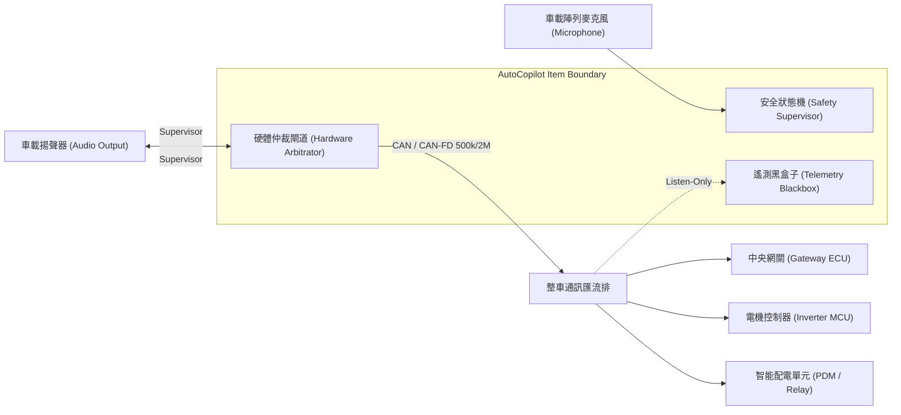

# ISO 26262-3:2018 項目定義規範 (Item Definition Document)

> **文件編號**：ITD-AUTOCP-ASILD-003  
> **項目名稱**：AutoCopilot 車載多模態自主診斷與即時安全控制系統  
> **適用車型**：新一代軟體定義新能源乘用車 (SDV / BEV)  

---

## 1. 項目功能描述與運行範圍 (Item Functional Description)
AutoCopilot 是一個整合「邊緣語音交互 + 即時診斷 + 底盤致動安全互鎖」之智慧車載電控系統：
- **語音診斷**：技師或駕駛透過自然語言語音發起 DTC 故障碼讀取、部件作動測試（如懸吊高度升降、冷卻液排氣、繼電器吸合）。
- **多模態推論**：基於本地/邊緣 LLM 進行故障引導診斷。
- **安全互鎖與致動**：當涉及實體致動指令時，由 ASIL-D 級別之 Safety Supervisor 與硬體仲裁器進行即時檢查、口語二次握手確認與微秒級總線故障防禦。

## 2. 項目邊界與介面定義 (Item Boundary & External Interfaces)

## 3. 整車環境條件與失效影響 (Environmental Constraints)
- **供電電壓**：標稱 12V DC (工作範圍 6V ~ 18V，支援 ISO 16750-2 冷啟動與負載突降拋負載保護)。
- **溫度範圍**：$-40^\circ	ext{C} \sim +105^\circ	ext{C}$ (符合 Grade 1 車規環境要求)。
- **總線介面**：相容 ISO 11898-1:2015 (CAN-FD) 與 ISO 14229-1:2020 (UDS on CAN)。
