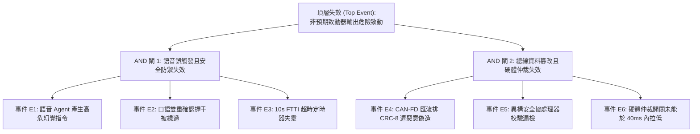

# ISO 26262-6:2018 軟體故障樹分析 (Software Fault Tree Analysis - SW-FTA)

> **文件編號**：FTA-AUTOCP-ASILD-010  
> **頂層失效事件 (Top Event)**：非預期致動器輸出高扭矩或危險作動  

---

## 1. 故障樹拓撲結構 (Fault Tree Topology)

## 2. 軟體單元失效模式與防禦措施對照表 (SW-FMEA)

| 軟體單元 (SW Unit) | 潛在失效模式 | 系統層級影響 | 內建防禦機制 (Safety Mechanism) | 殘餘風險 (Residual Risk) |
|:---|:---|:---|:---|:---:|
| **語音解析節點** | Token 序列解析錯誤輸出錯誤 ID | 誤觸發致動器測試 | 狀態機強制攔截至 `WAITING_CONFIRMATION`，要求技師口頭明確認可 | $< 10^{-9} / 	ext{h}$ |
| **FTTI 計時器** | 作業系統時鐘抖動延遲 | 超過 40ms 未進入 Safe State | 採用微秒級硬體時間戳 (`time.time()` / 硬體計數器)，雙重冗餘檢查 | $< 10^{-9} / 	ext{h}$ |
| **CRC-8 計算器** | 多項式運算暫存器溢出 | 錯誤報文被誤判為合法 | AUTOSAR 0x1D 查找表常數化，單元測試 100% MC/DC 覆蓋 | $< 10^{-9} / 	ext{h}$ |
| **環形緩衝區** | 高頻數據突發導致記憶體溢出 | 系統崩潰中斷通訊 | 固定容量 (200ms / 1000 幀) FIFO，自動丟棄最舊歷史幀，零記憶體增長 | $< 10^{-9} / 	ext{h}$ |
