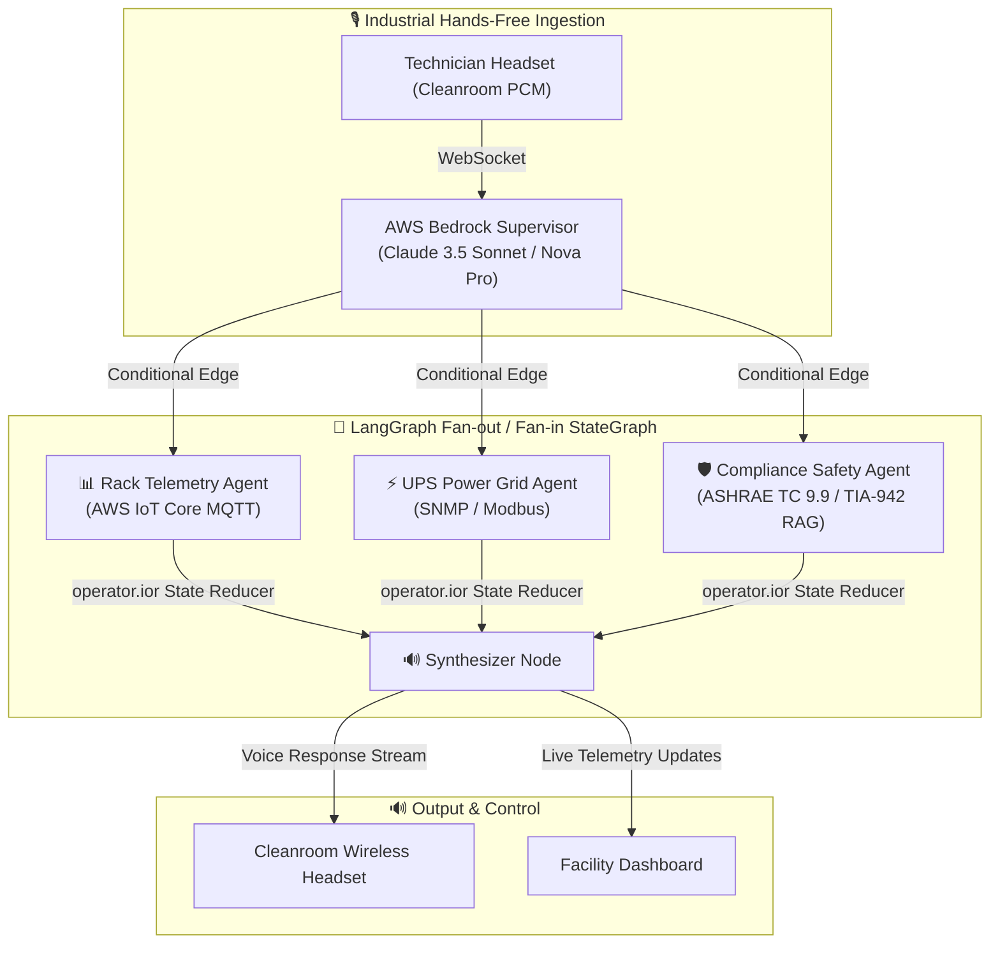

# FacilityCopilot: Hands-Free Voice AI for Data Centers & Semiconductor Cleanrooms
> **Powered by AWS Bedrock, IoT Core & LangGraph StateGraph**  
> *Targeting AWS AI & Industrial Enterprise Hackathons*

[](https://aws.amazon.com/bedrock/)
[](https://langchain-ai.github.io/langgraph/)
[](LICENSE)
[](https://streamlit.io/)

---

## 📌 Tagline
> **Real-time, hands-free voice diagnostic copilot for mission-critical data center facilities and cleanrooms, orchestrating server rack telemetry, UPS power grids, and ASHRAE compliance in sub-5ms.**

---

## 🏛️ Architecture: AWS Bedrock + LangGraph StateGraph



## 🚀 Quick Start
```bash
pip install -r requirements.txt
python test_facility_agent.py
streamlit run app.py
```
